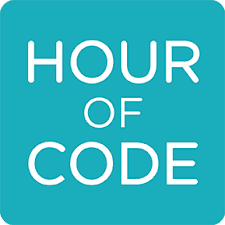
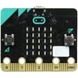

<h1>CoderDojo-shirakawa ポータルサイト</h1>
CoderDojo白河のポータルサイトです

<h2>プログラミング学習</h2>
<table>
<tr>
<td><a href="https://scratch.mit.edu/"> スクラッチ公式サイト</a></td>
<td><a href="https://hourofcode.com/jp/learn"> アワーオブコードアクティビティ紹介ページ</a></td>
<td><a href="https://blockly-games.appspot.com/"> Google監修 プログラミングの基礎を学べるゲーム</a></td>
</tr>
<tr>
<td><a href="https://makecode.microbit.org/#"> micro:bitオンラインエディタ</a></td>
<td><a href="https://www.mblock.cc/ja-jp/"> mBlockエディタ</a></td>
<td><a href="https://www.nhk.or.jp/sougou/programming/origin/scratch/playworld.html"> NHKの子供プログラミング番組公式サイト</a></td>
</tr>
</table>

<h2>参加者アンケート</h2>
<a href ="https://forms.gle/cTmvZKJYbdH96TvC9">アンケートはこちら</a>

<h2>Dojo関係</h2>
1. <a href ="http://coderdojo-shirakawa.mystrikingly.co">CoderDojo Shirakawa</a> コーダー道場白河の公式サイト
2. <a href ="https://coderdojo.jp">CoderDojo Japan</a> コーダー道場ジャパン公式サイト

2019 CoderDojo shirakawa

