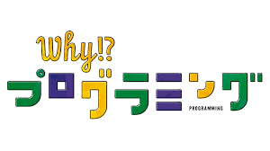

# CoderDojo-shirakawa ポータルサイト
CoderDojo白河のポータルサイトです

## 参加者アンケート

<a href="https://forms.gle/cTmvZKJYbdH96TvC9" class="btn-square">アンケートはこちら</a>

## プログラミング学習
|  |  |  |
|---|---|---|
|<a href="https://scratch.mit.edu/"> スクラッチ公式サイト</a>|<a href="https://hourofcode.com/jp/learn"> アワーオブコードアクティビティ紹介ページ</a>|<a href="https://blockly-games.appspot.com/"> Google監修 プログラミングの基礎を学べるゲーム</a>|
|<a href="https://makecode.microbit.org/#"> micro:bitオンラインエディタ</a>|<a href="https://www.mblock.cc/ja-jp/"> mBlockエディタ</a>|<a href="https://www.nhk.or.jp/sougou/programming/origin/scratch/playworld.html"> NHKの子供プログラミング番組公式サイト</a>|

## Dojo関係
1. [CoderDojo Shirakawa](http://coderdojo-shirakawa.mystrikingly.com) コーダー道場白河の公式サイト 
2. [CoderDojo Japan](https://coderdojo.jp) コーダー道場ジャパン公式サイト

2019 CoderDojo shirakawa

